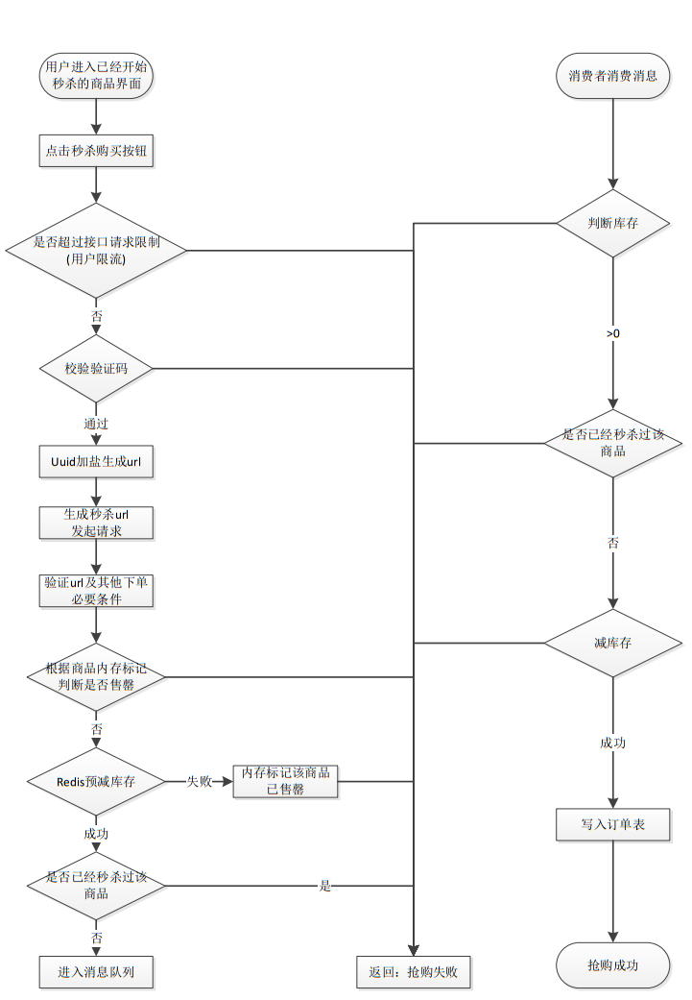

- [秒杀系统设计及问题解决](#%E7%A7%92%E6%9D%80%E7%B3%BB%E7%BB%9F%E8%AE%BE%E8%AE%A1%E5%8F%8A%E9%97%AE%E9%A2%98%E8%A7%A3%E5%86%B3)
  - [流程图](#%E6%B5%81%E7%A8%8B%E5%9B%BE)
  - [链接暴露](#%E9%93%BE%E6%8E%A5%E6%9A%B4%E9%9C%B2)
  - [资源静态化](#%E8%B5%84%E6%BA%90%E9%9D%99%E6%80%81%E5%8C%96)
  - [验证码](#%E9%AA%8C%E8%AF%81%E7%A0%81)
  - [库存预热](#%E5%BA%93%E5%AD%98%E9%A2%84%E7%83%AD)
  - [超卖](#%E8%B6%85%E5%8D%96)
  - [限流](#%E9%99%90%E6%B5%81)
    - [漏桶算法](#%E6%BC%8F%E6%A1%B6%E7%AE%97%E6%B3%95)
    - [令牌桶算法](#%E4%BB%A4%E7%89%8C%E6%A1%B6%E7%AE%97%E6%B3%95)
    - [分布式限流](#%E5%88%86%E5%B8%83%E5%BC%8F%E9%99%90%E6%B5%81)
  - [单用户限制接口请求频率](#%E5%8D%95%E7%94%A8%E6%88%B7%E9%99%90%E5%88%B6%E6%8E%A5%E5%8F%A3%E8%AF%B7%E6%B1%82%E9%A2%91%E7%8E%87)
  - [缓存与数据库的双写一致性](#%E7%BC%93%E5%AD%98%E4%B8%8E%E6%95%B0%E6%8D%AE%E5%BA%93%E7%9A%84%E5%8F%8C%E5%86%99%E4%B8%80%E8%87%B4%E6%80%A7)
    - [为什么不是更新缓存](#%E4%B8%BA%E4%BB%80%E4%B9%88%E4%B8%8D%E6%98%AF%E6%9B%B4%E6%96%B0%E7%BC%93%E5%AD%98)
    - [为什么不是先删缓存再更新数据库](#%E4%B8%BA%E4%BB%80%E4%B9%88%E4%B8%8D%E6%98%AF%E5%85%88%E5%88%A0%E7%BC%93%E5%AD%98%E5%86%8D%E6%9B%B4%E6%96%B0%E6%95%B0%E6%8D%AE%E5%BA%93)
    - [先更新数据库，再删除缓存可能存在的问题](#%E5%85%88%E6%9B%B4%E6%96%B0%E6%95%B0%E6%8D%AE%E5%BA%93%E5%86%8D%E5%88%A0%E9%99%A4%E7%BC%93%E5%AD%98%E5%8F%AF%E8%83%BD%E5%AD%98%E5%9C%A8%E7%9A%84%E9%97%AE%E9%A2%98)
    - [数据库和缓存一致性](#%E6%95%B0%E6%8D%AE%E5%BA%93%E5%92%8C%E7%BC%93%E5%AD%98%E4%B8%80%E8%87%B4%E6%80%A7)
      - [延时双删](#%E5%BB%B6%E6%97%B6%E5%8F%8C%E5%88%A0)
  - [缓存key的封装采用什么设计模式](#%E7%BC%93%E5%AD%98key%E7%9A%84%E5%B0%81%E8%A3%85%E9%87%87%E7%94%A8%E4%BB%80%E4%B9%88%E8%AE%BE%E8%AE%A1%E6%A8%A1%E5%BC%8F)


# 秒杀系统设计及问题解决

## 流程图



## 链接暴露

解决方案：URL动态化，MD5加密 + 盐值

前端先请求path接口，拿到动态生成加密后的秒杀接口，再请求接口{path}/do_miaosha

```java
@RequestMapping(value = "{path}/do_miaosha")
@ResponseBody
public ResultSk<Integer> miaosha(Model model, SkUser skUser, @RequestParam("goodsId") long goodsId, @PathVariable("path") String path) {
	...
    //验证path
    boolean check = skService.checkPath(skUser, goodsId, path);
    if (!check) {
        result.withError(REQUEST_ILLEGAL.getCode(), REQUEST_ILLEGAL.getMessage());
        return result;
    }
	...
}


@AccessLimit(seconds = 5, maxCount = 5, needLogin = true)
@RequestMapping(value = "path")
@ResponseBody
public ResultSk<String> skPath(Model model, SkUser skUser, @RequestParam("goodsId") long goodsId, @RequestParam(value = "verifyCode", defaultValue = "0") int verifyCode) {
    ResultSk<String> result = ResultSk.build();
    model.addAttribute("user", skUser);
    if (skUser == null) {
        result.withError(ResultStatus.SESSION_ERROR.getCode(), ResultStatus.SESSION_ERROR.getMessage());
        return result;
    }
    boolean check = skService.checkVerifyCode(skUser, goodsId, verifyCode);
    if (!check) {
        result.withError(REQUEST_ILLEGAL.getCode(), REQUEST_ILLEGAL.getMessage());
        return result;
    }
    String path = skService.createSkPath(skUser, goodsId);
    result.setData(path);
    return result;
}

@Override
public String createSkPath(SkUser skUser, long goodsId) {
    // 生成url
    String str = MD5Util.md5(UUIDUtil.generateUuid() + "123456");
    // 放入缓存
    redisService.set(SkKey.getSkPath, "" + skUser.getId() + "_" + goodsId, str);
    return str;
}

```

## 资源静态化

在前后端分离的项目中，页面一般都是不会经过后端的，前端也有自己的服务器，所以提前把能放入CDN服务器的东西都放进去，减少真正秒杀时候服务器的压力。

## 验证码

加入验证码或者滑块，防止秒杀的时候请求一起打过来。

## 库存预热

开始秒杀前通过定时任务提前把商品的库存加载到Redis中，让整个流程都在Redis里面去做。

## 超卖

原因：将商品的库存加载到Redis中，如果秒杀成功，再异步的修改库存。假如此时库存仅剩一个，四台服务器一起查询都发现还有一个，都去扣库存，此时库存变为-3，造成超卖。

解决方案：MySQL使用版本（CAS原理）

```mysql
select version from goods WHERE id= 1001
update goods set num = num - 1, version = version + 1 WHERE id = 1001 AND num > 0 AND version = @version(上面查到的version)
```

优化：使用Lua脚本，将判断库存和扣减库存都写在一个脚本中由Redis执行，如果return false则证明库存已减为0。

## 限流

### 漏桶算法

水（请求）先进入到漏桶里，漏桶以一定的速度出水，当水流入速度过大会直接溢出，可以看出漏桶算法能强行限制数据的传输速率。

### 令牌桶算法

能够限制数据的平均传输速率，还允许某种程度的突发传输。

在令牌桶算法中，只要令牌桶中存在令牌，那么就允许突发地传输数据直到达到用户配置的门限，因此它适合于具有突发特性的流量。

### 分布式限流

解决方案：Redis + Lua

```java
public static boolean acquire() throws IOException, URISyntaxException{
    Jedis jedis = new Jedis("127.0.0.1");
    String lua =
        "local key = KEYS[1] " +
        " local limit = tonumber(ARGV[1]) " +
        " local current = tonumber(redis.call('get', key) or '0')" +
        " if current + 1 > limit " +
        " then  return 0 " +
        " else " +
        " redis.call('INCRBY', key,'1')" +
        " redis.call('expire', key,'10') " +
        " end return 1 ";
    // 当前秒
    String key = "ip:" + System.currentTimeMillis() / 1000;
    // 最大限制
    String limit = "5";
    List<String> keys = new ArrayList<>();
    keys.add(key);
    List<String> args = new ArrayList<>();
    args.add(limit);
    jedis.auth("1234");
    String luaScript = jedis.scriptLoad(lua);
    Long result = (Long) jedis.evalsha(luaScript, keys, args);
    return result == 1;
}
```

分布式限流的关键是将限流做成具有原子性的功能，使用Redis+lua实现时间窗口内的流量控制。因为操作在lua脚本中并且redis是单线程的，所以线程安全。

## 单用户限制接口请求频率

[采用拦截器实现](seckill-system-springboot/doc/AccessLimit.md)

## 缓存与数据库的双写一致性

- 读的时候，先读缓存，缓存没有的话，就读数据库，然后取出数据后放入缓存，同时返回响应。
- 更新的时候，**先更新数据库，然后再删除缓存**。

### 为什么不是更新缓存

如果是写多读少的场景，频繁更新缓存浪费性能，有很多冷数据；

可能会存在脏数据（线程A更新了数据库；线程B更新了数据库；线程B更新了缓存；线程A更新了缓存）；

### 为什么不是先删缓存再更新数据库

（1）请求A进行写操作，删除缓存；

（2）请求B查询发现缓存不存在；

（3）请求B去数据库查询得到旧值；

（4）请求B将旧值写入缓存；

（5）请求A将新值写入数据库；

会导致数据不一致的情形出现。而且，如果不采用给缓存设置过期时间策略，该数据永远都是脏数据。

### 先更新数据库，再删除缓存可能存在的问题

假设有两个请求，请求A做查询操作，请求B做更新操作，可能发生：

（1）缓存刚好失效；

（2）请求A查询数据库，得一个旧值；

（3）请求B将新值写入数据库；

（4）请求B删除缓存；

（5）请求A将查到的旧值写入缓存；

发生这种情况的概率又有多少呢？

发生上述情况的前提：步骤（3）的写数据库操作比步骤（2）的读数据库操作耗时更短，才有可能使得步骤（4）先于步骤（5）。

但是，数据库的读操作的速度远快于写操作的，因此步骤（3）耗时比步骤（2）更短，这一情形很难出现。

### 数据库和缓存一致性

#### 延时双删

（1）先淘汰缓存；

（2）再写数据库（这两步和原来一样）；

（3）休眠1秒，再次淘汰缓存（休眠时间根据项目自定义）；

写数据的休眠时间则在读数据业务逻辑的耗时基础上，加几百ms即可。确保读请求结束，写请求可以删除读请求造成的缓存脏数据。

## 缓存key的封装采用什么设计模式

模板模式

+ 优点

  具体细节步骤实现定义在子类中，子类定义详细处理算法是不会改变算法整体结构；

  代码复用的基本技术，在数据库设计中尤为重要；

  存在一种反向的控制结构，通过一个父类调用其子类的操作，通过子类对父类进行扩展增加新的行为，符合“开闭原则”；

+ 缺点

  每个不同的实现都需要定义一个子类，会导致类的个数增加，系统更加庞大；

  