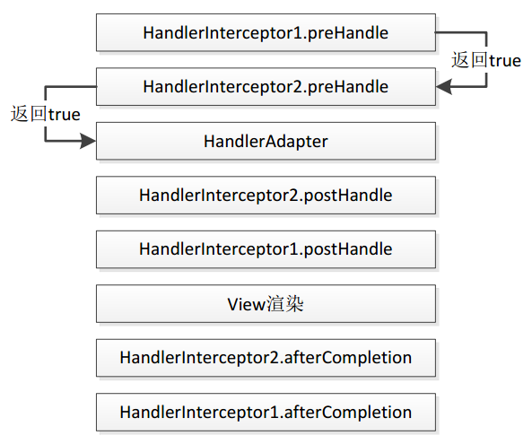
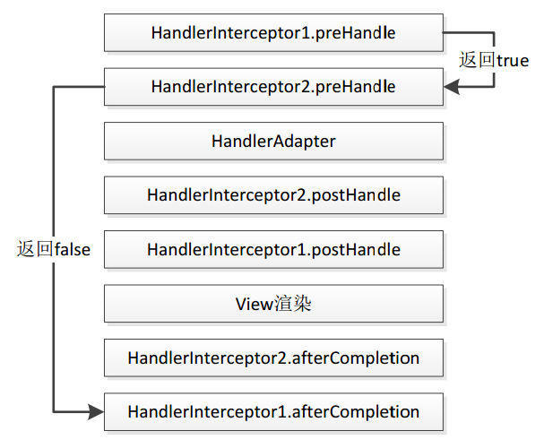

- [单用户限制接口请求频率](#%E5%8D%95%E7%94%A8%E6%88%B7%E9%99%90%E5%88%B6%E6%8E%A5%E5%8F%A3%E8%AF%B7%E6%B1%82%E9%A2%91%E7%8E%87)
  - [HandlerInterceptor](#handlerinterceptor)
    - [适用场景](#%E9%80%82%E7%94%A8%E5%9C%BA%E6%99%AF)
  - [HandlerInterceptorAdapter](#handlerinterceptoradapter)
  - [项目中的实现](#%E9%A1%B9%E7%9B%AE%E4%B8%AD%E7%9A%84%E5%AE%9E%E7%8E%B0)
    - [声明注解](#%E5%A3%B0%E6%98%8E%E6%B3%A8%E8%A7%A3)
    - [重写 HandlerInterceptorAdapter](#%E9%87%8D%E5%86%99-handlerinterceptoradapter)


# 单用户限制接口请求频率

## HandlerInterceptor

SpringMVC的处理器拦截器，类似于Servlet中的过滤器filter。

```java
public interface HandlerInterceptor {

   /**
     * 预处理回调方法，实现处理器的预处理（如检查登陆），第三个参数为响应的处理器，自定义Controller
     * 返回值：true表示继续流程（如调用下一个拦截器或处理器）
     * false表示流程中断(如登录检查失败)，不会继续调用其他的拦截器或处理器，此时我们需要通过response来产生响应；
   */
    boolean preHandle(HttpServletRequest request, HttpServletResponse response, Object handler)
            throws Exception;

   /**
     * 后处理回调方法，实现处理器的后处理（但在渲染视图之前），
     * 此时我们可以通过modelAndView（模型和视图对象）对模型数据进行处理
     * 或对视图进行处理，modelAndView也可能为null
   */
    void postHandle(HttpServletRequest request, HttpServletResponse response, Object handler, ModelAndView modelAndView)
            throws Exception;

   /**
    * 整个请求处理完毕回调方法，即在视图渲染完毕时回调，
    * 如性能监控中我们可以在此记录结束时间并输出消耗时间，还可以进行一些资源清理，
    * 类似于try-catch-finally中的finally，但仅调用处理器执行链中
   */
    void afterCompletion(HttpServletRequest request, HttpServletResponse response, Object handler, Exception ex)
            throws Exception;
}
```

### 适用场景

1. 日志记录，记录请求信息的日志，以便进行信息监控，信息统计等；
2. 权限检查，如登陆检测，进入处理器检测是否登陆，如果没有直接返回到登陆页面；
3. 性能监控，如慢日志；

## HandlerInterceptorAdapter

有时只需实现三个回调方法中的某个，如果实现HandlerInterceptor接口，三个方法必须都实现，此时Spring提供了一个HandlerInterceptorAdapter适配器，允许只实现需要的回调方法。

```java
public abstract class HandlerInterceptorAdapter implements AsyncHandlerInterceptor {
    public HandlerInterceptorAdapter() {
    }

    public boolean preHandle(HttpServletRequest request, HttpServletResponse response, Object handler) throws Exception {
        return true;
    }

    public void postHandle(HttpServletRequest request, HttpServletResponse response, Object handler, @Nullable ModelAndView modelAndView) throws Exception {
    }

    public void afterCompletion(HttpServletRequest request, HttpServletResponse response, Object handler, @Nullable Exception ex) throws Exception {
    }

    public void afterConcurrentHandlingStarted(HttpServletRequest request, HttpServletResponse response, Object handler) throws Exception {
    }
}
```






运行流程总结如下：

1、拦截器执行顺序是按照Spring配置文件中定义的顺序而定的；

2、先按照顺序执行所有拦截器的preHandle方法，一直遇到return false为止，return false之后的所有拦截器都不会执行；若都是return true，则按顺序加载完preHandle方法；

3、执行主方法（自己的controller接口），若中间抛出异常，则跟return false效果一致，不会继续执行postHandle，只会倒序执行afterCompletion方法；

4、在主方法执行完业务逻辑（页面还未渲染数据）时，按倒序执行postHandle方法。若第三个拦截器的preHandle方法return false，则会执行第二个和第一个的postHandle方法和afterCompletion（postHandle都执行完才会执行这个，也就是页面渲染完数据后，执行after进行清理工作）方法。（postHandle和afterCompletion都是倒序执行）；

## 项目中的实现

### 声明注解

```java
@Retention(RetentionPolicy.RUNTIME)
@Target(ElementType.METHOD)
public @interface AccessLimit {
    int seconds();
    int maxCount();
    boolean needLogin() default true;
}
```

### 重写 HandlerInterceptorAdapter

```java
@Service
public class AccessInterceptor extends HandlerInterceptorAdapter {

    @Autowired
    private UserService userService;

    @Autowired
    private RedisService redisService;

    @Override
    public boolean preHandle(HttpServletRequest request, HttpServletResponse response, Object handler) throws Exception {
        if (handler instanceof HandlerMethod) {
            SkUser skUser = getUser(request, response);
            UserContext.setUser(skUser);

            HandlerMethod handlerMethod = (HandlerMethod) handler;
            // 获取注解
            AccessLimit accessLimit = handlerMethod.getMethodAnnotation(AccessLimit.class);
            if (accessLimit == null) {
                return true;
            }
            // 获取限流的单位时间
            int seconds = accessLimit.seconds();
            // 获取限制的最大请求数
            int maxCount = accessLimit.maxCount();
            // 是否需要登录
            boolean needLogin = accessLimit.needLogin();
            String key = request.getRequestURI();
            if (needLogin) {
                if (skUser == null) {
                    render(response, ResultStatus.SESSION_ERROR);
                    return false;
                }
                key = key + "_" + skUser.getId();
            } else {
                // do nothing
            }

            AccessKey accessKey = AccessKey.withExpire(seconds);
            // 从缓存中获取当前请求计数
            Integer count = redisService.get(accessKey, key, Integer.class);
            if (count == null) {
                // 第一次请求
                redisService.set(accessKey, key, 1);
            } else if (count < maxCount) {
                // 小于限制的最大请求数
                redisService.incr(accessKey, key);
            } else {
                // 达到最大请求数
                render(response, ResultStatus.ACCESS_LIMIT_REACHED);
                return false;
            }
        }
        return true;
    }

    private void render(HttpServletResponse response, ResultStatus resultStatus) throws Exception {
        response.setContentType("application/json;charset=UTF-8");
        OutputStream outputStream = response.getOutputStream();
        String str = JSON.toJSONString(ResultSk.error(resultStatus));
        outputStream.write(str.getBytes(StandardCharsets.UTF_8));
        outputStream.flush();
        outputStream.close();
    }
    
	...
}
```

